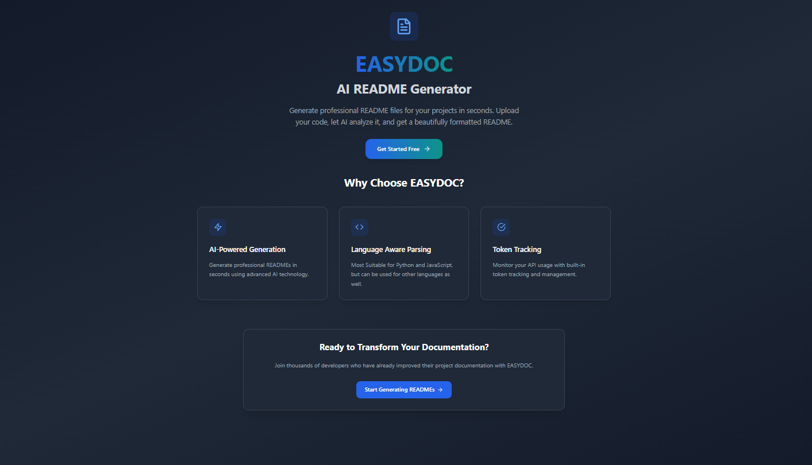

# README Generator: Automated README Creation for Software Projects



## Table of Contents

- [Project Title and Brief Description](#project-title-and-brief-description)
- [Overview/About](#overviewabout)
- [Features](#features)
- [Installation](#installation)
    - [Client-Side Installation](#client-side-installation)
    - [Server-Side Installation](#server-side-installation)
- [Usage](#usage)
- [Configuration](#configuration)
- [API Documentation](#api-documentation)
- [Project Structure](#project-structure)
- [Contributing](#contributing)
- [License](#license)


## Overview/About

This application automates the creation of professional README.md files for software projects. Leveraging the power of Google Gemini's AI, it analyzes your codebase, extracts key information, and generates a well-structured README file, saving you valuable time and effort. The application consists of a user-friendly client-side interface (built with Vite, React, TypeScript, and Tailwind CSS) and a robust server-side application (built with Python and Flask) that handles the README generation process.


## Features

* **Automated README Generation:** Analyzes codebases to create professional README files.
* **Language Support:** Supports various programming languages (Python, JavaScript, TypeScript, Java, etc.).
* **Customizable Prompts:** Allows users to specify requirements for the README content.
* **Gemini API Integration:** Leverages Google Gemini for advanced text generation, offering various model options (gemini-1.5-flash, gemini-2.0-flash, gemini-2.5-flash, gemini-pro).
* **User Authentication:** Secure user authentication with Clerk.
* **Token Management:** Tracks API token usage and manages rate limits.
* **Responsive UI:** Modern, responsive user interface for seamless cross-device usage.
* **Robust Error Handling:** Provides informative feedback mechanisms.
* **Cloud-Based Storage (MongoDB):** Stores generated READMEs for retrieval and management.


## Installation

### Client-Side Installation

1. Navigate to the `client` directory:
   ```bash
   cd project/client
   ```

2. Install dependencies:
   ```bash
   npm install
   ```

3. Set up environment variables in `.env`: This file should contain your Clerk Publishable Key.  (Instructions for obtaining this key are available on the Clerk website -  [link to be added here]).  Example:

   ```
   PUBLISHABLE_KEY=YOUR_CLERK_PUBLISHABLE_KEY
   ```

### Server-Side Installation

1. Navigate to the `server` directory:
   ```bash
   cd ../server
   ```

2. Create a virtual environment (recommended):
   ```bash
   python3 -m venv venv310
   source venv310/bin/activate  # On Windows: venv310\Scripts\activate
   ```

3. Install dependencies:
   ```bash
   pip install -r requirements.txt
   ```

4. Set up environment variables in `.env`:  This file should contain your Google Gemini API key, MongoDB connection string, and Clerk Secret Key. Example:

   ```
   API_KEY=YOUR_GEMINI_API_KEY
   MONGO_URI=YOUR_MONGODB_CONNECTION_STRING
   CLERK_SECRET_KEY=YOUR_CLERK_SECRET_KEY
   JWKS_URL=YOUR_CLERK_JWKS_URL #Clerk JWKS URL, obtained from Clerk
   ```

5. Configure parameters in `app.py`: Set appropriate values for `MAX_FILE_SIZE`, `MAX_INDIVIDUAL_FILE_SIZE`, `MAX_TOKENS`, `RPM_DELAY`, and `IGNORE_PATTERNS` according to your needs and resource limits.


## Usage

1. **Upload Your Project:** Zip your project folder and upload it through the client interface.
2. **Specify Prompt (Optional):**  Provide a description of your desired README content (e.g., "Generate a README with sections for installation, usage, and contributing").
3. **Select AI Model (Optional):** Choose from available Gemini models (gemini-1.5-flash, gemini-2.0-flash, gemini-2.5-flash, gemini-pro).  Higher model numbers generally offer improved performance but may be more expensive.
4. **Generate README:** Click "Generate". The application will upload, process, and generate the README.
5. **Download README:** Download the generated `README.md` file.


## Configuration

The application relies on several environment variables.  See the [Environment Variables](#environment-variables) section for details.


## API Documentation

The server exposes several API endpoints for managing READMEs and user accounts.  Authentication is required for most endpoints.

* `/`: Health check.
* `/generate_readme`: Generates a README.  Accepts a zipped project and optional prompt.
* `/usage_stats`: Retrieves usage statistics.
* `/delete_readme`: Deletes a README by ID.
* `/delete_account`: Deletes the user's account.
* `/download_readme`: Downloads a README by ID.
* `/list_readmes`: Lists all user READMEs.
* `/save_apikey`: Saves or updates the API key.
* `/get_apikey`: Retrieves the API key.


## Project Structure

```
project/
├── client/             # React client-side application
│   ├── src/             # Client-side source code
│   │   ├── components/  # Reusable UI components
│   │   ├── context/    # Context providers
│   │   ├── pages/      # Application pages
│   │   └── ...
├── server/            # Python server-side application
│   ├── app.py          # Main Flask application
│   └── ...

```


## Contributing

Contributions are welcome! Please follow standard Git workflow (fork, branch, pull request).


## License

MIT © Anvin George


## Environment Variables

* **Client:**
    * `PUBLISHABLE_KEY`: Your Clerk Publishable Key.

* **Server:**
    * `API_KEY`: Your Google Gemini API key.
    * `MONGO_URI`: Your MongoDB connection string.
    * `CLERK_SECRET_KEY`: Your Clerk Secret Key.
    * `JWKS_URL`: Your Clerk JWKS URL.
    * `MAX_FILE_SIZE`: Maximum ZIP file size (bytes).
    * `MAX_INDIVIDUAL_FILE_SIZE`: Maximum individual file size within ZIP (bytes).
    * `MAX_TOKENS`: Maximum tokens per Gemini API call.
    * `RPM_DELAY`: Delay between Gemini API calls (seconds).
    * `IGNORE_PATTERNS`: Regular expressions for ignoring files/directories.

Remember to replace placeholder values with your actual credentials.